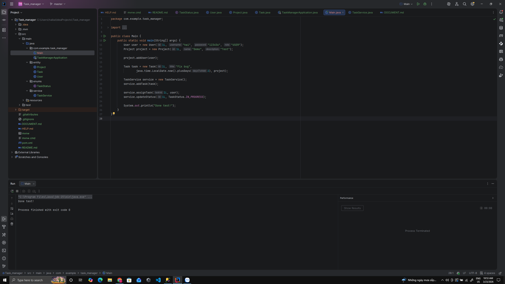

# 📌 Task Management System (Spring Boot)

## 📖 Giới thiệu

Hệ thống quản lý công việc gồm:

* User
* Project
* Task

Cho phép:

* Tạo project
* Tạo task
* Gán task cho user
* Cập nhật trạng thái task
* Phân quyền bằng JWT

---

## ⚙️ Công nghệ sử dụng

* Java 17
* Spring Boot
* Spring Data JPA
* SQL Server
* JWT Authentication
* Maven

---

## 🚀 Cách chạy project

### 1. Clone project

```bash
git clone <link github>
```

### 2. Cấu hình database

Sá»­a file `application.properties`:

```properties
spring.datasource.url=jdbc:sqlserver://localhost:1433;databaseName=YourDB
spring.datasource.username=sa
spring.datasource.password=123456
```

### 3. Run project

```bash
mvn spring-boot:run
```

---

## 🔐 Authentication

### Login

```http
POST /api/auth/login
```

Response:

```json
{
  "token": "JWT_TOKEN"
}
```

👉 Dùng token:

```
Authorization: Bearer <token>
```

---

## 📌 API chính

### Task

* POST /api/tasks → tạo task
* PATCH /api/tasks/{id}/status → update status
* GET /api/tasks/project/{id}
* GET /api/tasks/user/{id}

### Project

### Task (Updated)

* POST /api/tasks
* PUT /api/tasks/{taskId}/status
* PUT /api/tasks/{taskId}/assign/{userId}
* GET /api/tasks/project/{projectId}
* GET /api/tasks/user/{userId}

* POST /api/projects
* GET /api/projects

### User

* POST /api/auth/register
* POST /api/auth/login

---

## 📊 Business Rule

* Task chỉ assign cho user thuộc project
* Không cho update task khi status = DONE
* Deadline phải > hiện tại

---

## 🧪 Test

* Dùng Postman hoặc Swagger
* Có sẵn data test trong file SQL

### Ảnh test console

//output tuan 1



### Link Ảnh test

* [Test Console](docs/images/test-console.png)
* [Postman Test API](docs/postman/Test_API.png)
* [Postman Image](docs/postman/img.png)

### Link Ảnh test Postman

* [Postman Test API](docs/postman/Test_API.png)
* [Postman Image](docs/postman/img.png)

---

## 👨‍💻 Tác giả

* Trần Đức Hải
#duchai.40net@gmail.com
* haitdph41477@fpt.edu.vn
* ## Week 3 - User API

- Xây dựng UserEntity, Repository, Service, Controller
- Implement API create và get user
- Xử lý lỗi cơ bản (null, duplicate)
- Áp dụng Global Exception Handler
- Refactor naming theo chuẩn clean code

* ## Week 4 - Task Mapping & API

### 1. Mapping Entity (QUAN TRỌNG NHẤT)

User ↔ Task (1-N)

```java
@OneToMany(mappedBy = "user")
private List<Task> tasks;
```

Project ↔ Task (1-N)

```java
@OneToMany(mappedBy = "project")
private List<Task> tasks;
```

Task (nhiều → 1)

```java
@ManyToOne
@JoinColumn(name = "user_id")
private User user;

@ManyToOne
@JoinColumn(name = "project_id")
private Project project;
```

### 2. Fix Lazy/Eager (CỰC KỲ HAY BỊ HỎI)

Mặc định:

```java
@ManyToOne(fetch = FetchType.LAZY)
```

Để tránh lỗi JSON (infinite loop), cách chuẩn:

```java
@JsonIgnore
private User user;
```

hoặc:

```java
@JsonManagedReference
@JsonBackReference
```

### 3. TaskRepository

```java
package com.example.task_manager.repository;

import com.example.task_manager.entity.Task;
import org.springframework.data.jpa.repository.JpaRepository;

import java.util.List;

public interface TaskRepository extends JpaRepository<Task, Long> {

    List<Task> findByUserId(Long userId);

    List<Task> findByProjectId(Long projectId);
}
```

### 4. TaskService

```java
package com.example.task_manager.service;

import com.example.task_manager.entity.Task;
import com.example.task_manager.repository.TaskRepository;
import org.springframework.stereotype.Service;

import java.util.List;

@Service
public class TaskService {

    private final TaskRepository repository;

    public TaskService(TaskRepository repository) {
        this.repository = repository;
    }

    public List<Task> getByUser(Long userId) {
        return repository.findByUserId(userId);
    }

    public List<Task> getByProject(Long projectId) {
        return repository.findByProjectId(projectId);
    }
}
```

### 5. TaskController (PHẢI CÓ)

```java
package com.example.task_manager.controller;

import com.example.task_manager.entity.Task;
import com.example.task_manager.service.TaskService;
import org.springframework.web.bind.annotation.*;

import java.util.List;

@RestController
@RequestMapping("/api/tasks")
public class TaskController {

    private final TaskService service;

    public TaskController(TaskService service) {
        this.service = service;
    }

    @GetMapping("/user/{userId}")
    public List<Task> getByUser(@PathVariable Long userId) {
        return service.getByUser(userId);
    }

    @GetMapping("/project/{projectId}")
    public List<Task> getByProject(@PathVariable Long projectId) {
        return service.getByProject(projectId);
    }
}
```
### 6. API list task

* API list task theo user: OK
* API list task theo project: OK
//week 4 - Task Mapping & API
•
Infinite loop: quan hệ 2 chiều → dùng @JsonIgnore hoặc DTO.
•
LazyInitializationException: truy cập LAZY sau session → DTO + fetch join.
•
Null FK: chưa set user/project → load entity và set trước save.
